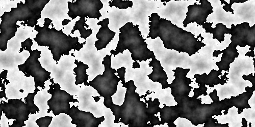
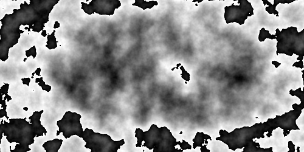
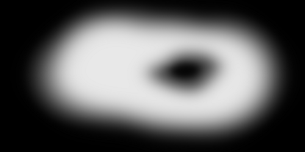
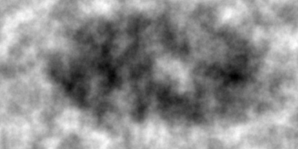
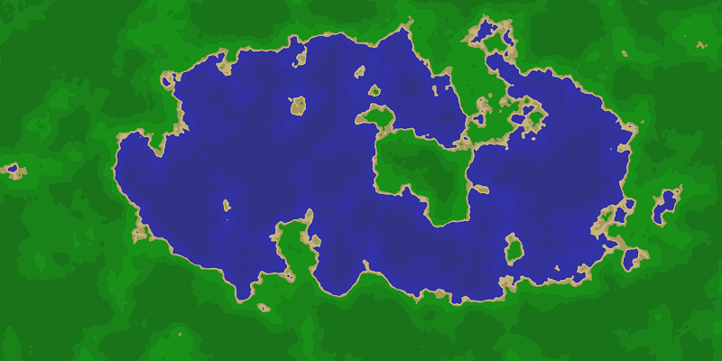

This program procedurally generates images of lakes from the [noise package](https://github.com/caseman/noise) and the included [filters](/filters). I was originally inspired by [this blog post](https://medium.com/@yvanscher/playing-with-perlin-noise-generating-realistic-archipelagos-b59f004d8401) about procedurally generating islands.

# [Skip the blabbering ... how does it work?](#how-does-it-work)

## But... why?
I have always been interested in the creative powers of computing. When I was younger I enjoyed playing with different simulators and games with procedural generation. Delegating creative powers to a computer affords a privileged position - you can control the process but escape the minutiae. Even though you define everything you can still explore the results with curiousity and enthusiasm.

In addition, I spent my formative years in Minnesota, Land of 10,000 Lakes, where I escaped up north to the [BWCA](https://bwca.com/) as often as possible. I think this project is an expression of that same desire to explore.

From a more technical perspsective, it offered a good opportunity explore the numpy library, especially matrix operations, and image processing. 

This was probably my first independant project and I have since returned to improve it (dramatically). I have applied what I've learned in terms of object-oriented design and analysing algorithms. I intend to do a proper write-up on my improvements, but for now you can see [my notes](/profiling/notes.txt) in the 'profiling' folder. The gist of it is the code is much better encapsulated, user friendly, and faster by more than a factor of 10.

# How does it work?

All the inputs are defined in the [config.ini file](/src/config.ini). Documentation for these settings can be found in [Config.py](/src/Config.py). This makes it easy to change paramaters from a text editor.

Perlin noise, to oversimplify it, is a way to generate "smooth" random numbers. [Here is a proper explanation](https://adrianb.io/2014/08/09/perlinnoise.html). 

The process starts with initializing the matrix and filling it with noise values according to the noise parameters defined in <code>config.ini</code>. These will fall between -1.0 and 1.0.That gives us something like so:

The image looks weird (unlike "normal") perlin noise because it's range is between -1.0 and 1.0. We will constrain it to 0 and -1, but first we will apply our filter, which ensures there is some sort of "lake" shape. For comparison, the filter in use is on the right.

 

Now we will normalize the range so that all of our number fall between 0-1. Darkest is 0.0, lightest is 1.0.

At this point we can assign certain colors to elements that fall within a certain range. For example, everything below 0.28 will be the deepest level, so it will be set to dark blue. This gives us our final image.

In addition, it outputs some stats as a JSON object as well as a copy of the config.ini file so that you can see what configuration was used.
